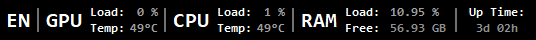

# System Monitoring
This program is designed to monitor computer sensors such as:
- Current keyboard layout
- CPU
- - CPU Temperatures
- - CPU Load
- GPU
- - GPU Temperatures
- - GPU Load
- RAM
- - RAM Load
- - RAM Free
- Up Time  

It also colors some indicators depending on load/temperature.

*This is my first project and experience in C# and it was made for myself, but everyone can use it for their needs.*

## Screenshots:

## Todo:  
- [ ]  Create a settings window
- - [ ]  Possibility to change indicators color settings
